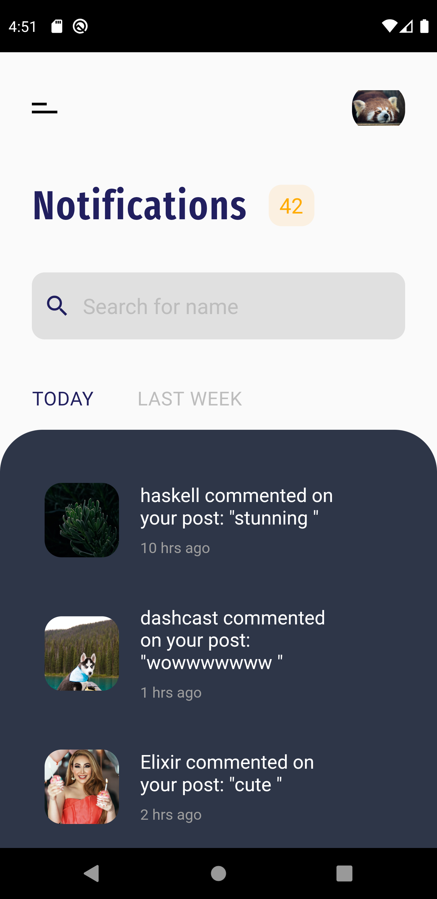

# social_media_ui

A new Flutter project to replicate the following design and showcase the skills.

## Dribbble design inspiration by [OutCrowd](https://dribbble.com/shots/6659481-Mobile-app-Social-media-network)

### screenshots

## images are taken from the [unsplash](https://unsplash.com)

